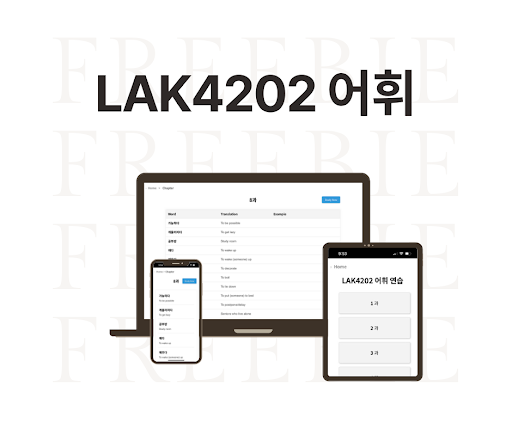
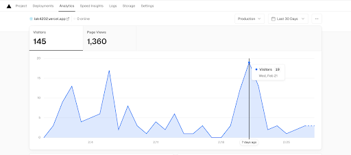
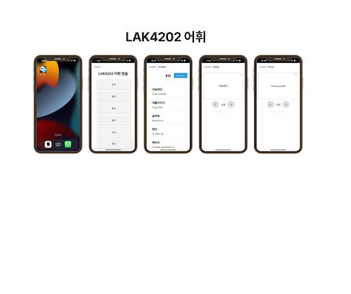

# LAK4202 Korean Vocabulary App

## The Problem I Solved
In early 2024, I observed that my classmates in LAK4202 (Korean 6 language course) were spending a lot of time creating their own vocabulary flashcards using apps like Anki. Since most of us were making very similar vocabulary lists independently, I saw an opportunity to simplify the process and help my peers focus more on learning rather than repetitive flashcard creation. This turned out to be a good revision resource for my peers, reaching 1360 page visits/month and was used by many of my classmates while supporting multiple types of devices. 

## My Solution

I decided to build a web app that would:
1. **Centralize all vocabulary** in one accessible place
2. **Work seamlessly on any device** (especially phones for studying on-the-go)
3. **Require minimal clicks** to start practicing
4. **Update automatically** without me having to constantly deploy new versions


## What I built
A React-based vocabulary learning app that transforms studying into a streamlined, three-click experience. The app automatically pulls new vocabulary words from a shared Google Sheet and generates flashcards accessible to classmates within one minute. Designed to be minimalistic and clutter-free, the app helps users learn efficiently without distractions.




**The impact**:
 Over 1,300 visits in 30 days, with 80% of my class using it before midterms/finals.



**Preferred Device**: 
Most of my classmates shared that they decided to study on their mobile phones on the way to school before classes/exams.




### Technical Decisions I Made
- **React**: Chose it for component reusability and my familiarity with the framework
- **Google Sheets Integration**: I could let classmates contribute vocabulary directly through a shared sheet, and the app would pull updates automatically
- **Mobile-First Design**: Knowing most students would study on their phones
- **Vercel Analytics**: To track actual usage and prove the app's value


## How I Built It

**Frontend**: React 18 with React Router for navigation  
**Data Source**: Google Sheets (genius move for collaborative content management)  
**Styling**: Custom CSS with mobile-responsive design  
**Deployment**: Vercel for easy continuous deployment  
**Analytics**: Vercel Analytics to track real usage

### Key Features I Implemented
- Chapter-based organization matching our course structure
- Flashcard-style vocabulary practice
- Real-time data sync from Google Sheets
- Mobile-optimized interface
- Usage analytics to measure impact

## What I Learned

### Technical Skills
- **React ecosystem**: Deeper understanding of components, routing, and state management
- **API integration**: Working with Google Sheets as a dynamic data source
- **Responsive design**: Creating truly mobile-first experiences
- **Analytics implementation**: Measuring real user behavior

### Product Skills
- **User research**: Observing actual pain points vs. assumed problems
- **Iterative development**: Launching quickly and improving based on feedback
- **Data-driven decisions**: Using analytics to understand usage patterns

## Code Architecture

I kept the structure simple but scalable:

```
src/
├── App.js              # Main app with routing logic
├── Homepage.js         # Chapter selection interface
├── ChapterPage.js      # Individual chapter vocabulary
├── StudyPage.js        # Flashcard study mode
├── FetchCSVData.js     # Google Sheets integration magic
├── Breadcrumbs.js      # Navigation breadcrumbs
└── [Component].css     # Component-specific styling
```

## Try It Yourself

Want to see how it works or run it locally?

### Prerequisites
- Node.js (v14+)
- npm or yarn

### Setup
```bash
# Clone the project
git clone https://github.com/jgyj123/lak4202.git
cd lak4202

# Install dependencies
npm install

# Start development server
npm start

# Build for production
npm run build
```

## The Bigger Picture

This project taught me that sometimes the best solutions come from solving your own problems. What started as a personal frustration became a tool that helped dozens of my classmates succeed in their Korean studies.

**Key takeaway**: Real users + real feedback + rapid iteration = successful products

